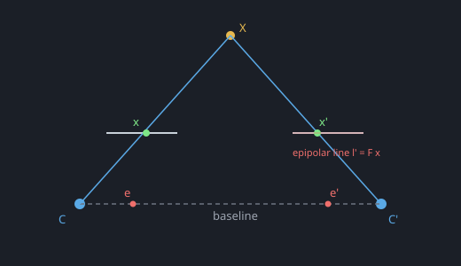

Epipolar geometry is the intrinsic geometry of two views of the same scene. Once
the relative pose is fixed, a point $x$ in the left image cannot match *anywhere*
in the right image — its correspondence must lie on a single **epipolar line**.
That is exactly the constraint SfM uses to verify feature matches and reject
outliers.

The key players:

- **Baseline** — the line joining the two camera centres $C$ and $C'$.
- **Epipoles** $e, e'$ — where the baseline pierces each image plane; every
  epipolar line in an image passes through its epipole.
- **Epipolar line** — for a point $x$, its match lies on $l' = F x$ in the other
  image, where $F$ is the fundamental matrix (the uncalibrated cousin of the
  essential matrix).

Reducing the correspondence search from 2D to a 1D line is what makes robust
matching tractable; the residual distance from a point to its epipolar line is a
close relative of [reprojection error](help:reprojection-error).
